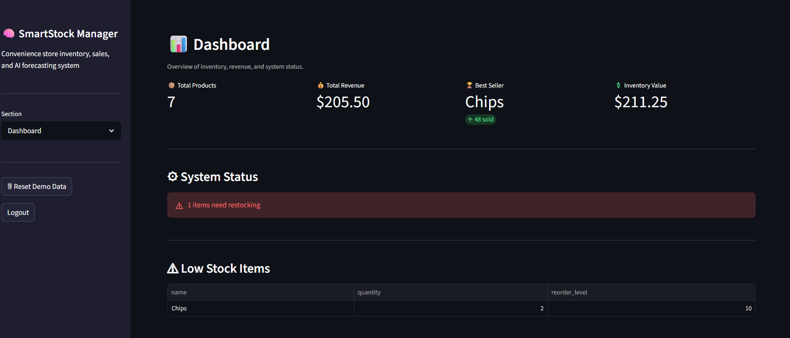
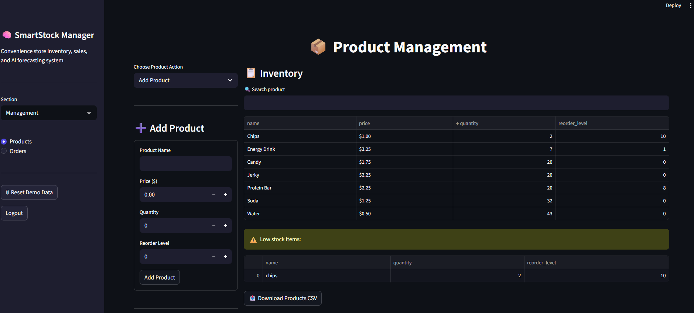
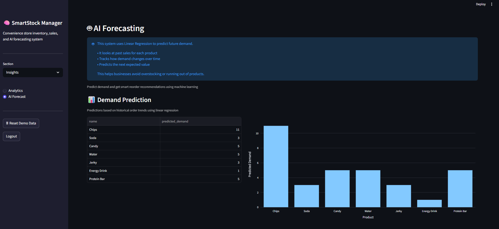
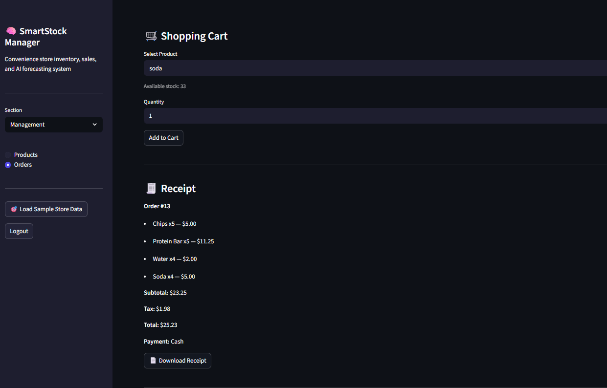
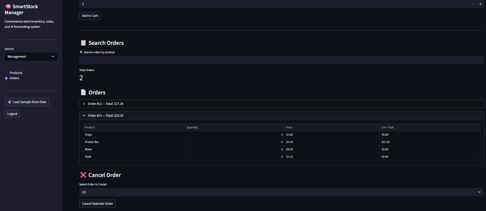

# SmartStock Manager


AI-powered inventory and order management system built with Python, SQLite, Streamlit, Plotly, and machine learning forecasting.

## Live Demo

https://smartstock-manager.streamlit.app/

Demo users can:
- Load sample store data
- Manage inventory
- Create customer orders
- Use a shopping cart checkout
- View analytics and AI forecasting

### Demo Access

Use the built-in Demo User option on the login page or create your own account.

---

## Features

### Inventory Management
- Add, edit, and delete products
- Inventory quantity tracking
- Product image support
- Low-stock alerts
- Inventory value calculations

### Order Management
- Multi-item shopping cart
- Customer checkout workflow
- Automatic inventory updates
- Tax calculation
- Receipt generation
- Receipt download
- Order history grouped by order
- Order cancellation with inventory restoration

### Analytics Dashboard
- Revenue tracking
- Best-selling product identification
- Inventory value metrics
- Sales analytics visualizations

### AI Forecasting
- Demand forecasting using Linear Regression
- Smart reorder recommendations
- Inventory planning support

### Data Import / Export
- CSV product import
- CSV product export
- Bulk inventory updates

### Security
- User registration
- User authentication
- Password hashing
- Session management

### Automated Testing
- Automated unit testing with Pytest
- Product creation validation tests
- Order workflow testing
- Order cancellation testing
- Inventory validation
- Supports future regression testing as new features are added

---

## Technologies Used

- Python
- SQLite
- Streamlit
- Pandas
- Plotly
- Scikit-Learn
- Git / GitHub
- Pytest

---

## Installation

Clone the repository:

```bash
git clone https://github.com/ajh767676/smartstock-manager.git
cd smartstock-manager
```

Create and activate a virtual environment:

```bash
python -m venv venv
venv\Scripts\activate
```

Install dependencies:

```bash
pip install -r requirements.txt
```

Run the application:

```bash
streamlit run app.py
```

---

## Screenshots

### Dashboard



### Product Management



### AI Forecasting



### Shopping Cart & Checkout



### Order History & Order Management



## Project Purpose

SmartStock Manager was developed as a Computer Science capstone project to demonstrate:

- Software Development
- Database Design
- Data Analytics
- Machine Learning Integration
- User Authentication
- Business Process Automation

The project simulates a real-world retail inventory and point-of-sale system for small businesses. It demonstrates inventory management, customer checkout workflows, analytics reporting, machine learning forecasting, user authentication, and business process automation.

---

## Future Enhancements

- Role-based access control (Admin / Employee)
- REST API using FastAPI
- Cloud database deployment
- Automated email alerts for low inventory
- Advanced forecasting models
- Expanded test coverage and integration testing